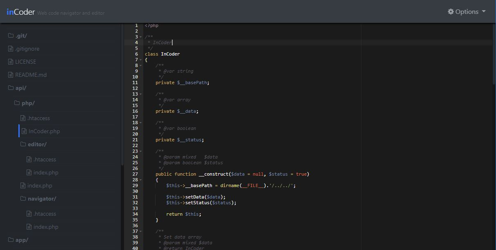

# inCoder PHP API

InCoder is an API-based online code editor.

The idea is to provide a simple way to develop or change web site and application code quickly, conveniently and completely online, just by using a web browser through a computer, tablet or smartphone.

## Screenshot

## Demo

[http://www.inicial.com.br/incoder/](http://www.inicial.com.br/incoder/)